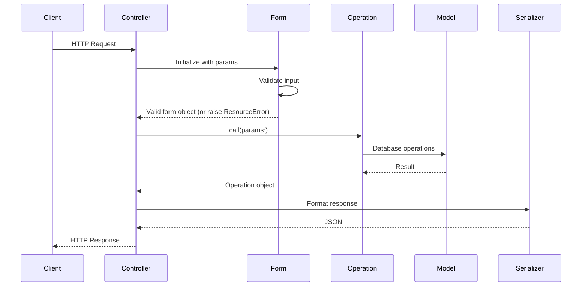
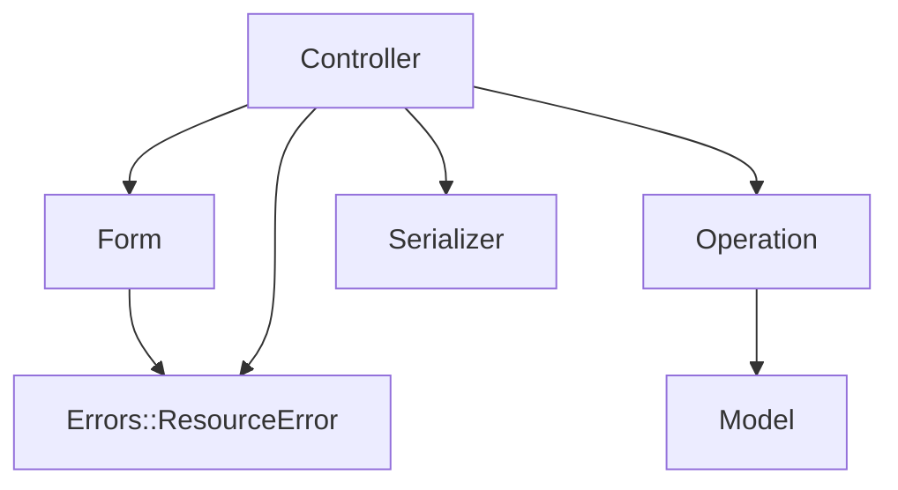

# Architecture

## What is HMVC?

HMVC (Hierarchical Model–View–Controller) extends classic MVC with two additional layers — **Form** and **Operation** — so each part of the stack has a well-defined responsibility.

The guiding principle is the **Single Responsibility Principle**: each class should do one job well.

## Directory layout

```
app/
├── controllers/{version}/           # HTTP request/response
│   └── v1/
│       └── users_controller.rb
├── forms/{version}/{resource}/      # Input validation
│   └── v1/users/
│       ├── create_form.rb
│       └── update_form.rb
├── operations/{version}/{resource}/ # Business logic
│   └── v1/users/
│       ├── index_operation.rb
│       ├── create_operation.rb
│       └── ...
├── serializers/{version}/           # Response formatting
│   └── v1/
│       └── user_serializer.rb
└── models/                          # ActiveRecord models

lib/errors/                          # Custom error classes
```

## Request flow



## Role of each layer

### Controller

- **Accepts** HTTP requests and **returns** HTTP responses
- Invokes Forms for validation and Operations for work
- Uses `render_collection` / `render_resource` for rendering
- **Must not** contain business logic or talk to the database directly

### Form

- **Validates** and **transforms** input parameters
- Raises `Errors::ResourceError` on failure (via `valid!`)
- **Must not** touch the database

### Operation

- Holds all **business logic**
- Exposes a single public entry point: `call`
- Complex flows are broken into private `step_*` methods
- Owns persistence and other side effects (e.g. DB access)

### Serializer

- **Shapes** domain data into JSON for the response
- No business rules

### Model

- Standard ActiveRecord/Mongoid usage
- Associations, scopes, enums
- Heavier domain logic belongs in `app/models/concerns`

### Error layer

- The `Errorable` concern on the controller wires up `rescue_from` handlers
- `Errors::ResourceError` — validation failures originating from Forms
- `Errors::APIError` — API errors with an explicit HTTP status
- `ApplicationError` and subclasses — conventional errors (not found, unauthorized, forbidden)

## Layer dependencies



The controller is the orchestration hub. Form and Operation are intentionally decoupled — neither depends on the other.

## Naming conventions

| Layer      | File                             | Class                    |
|------------|----------------------------------|--------------------------|
| Controller | `v1/users_controller.rb`       | `V1::UsersController`    |
| Operation  | `v1/users/create_operation.rb`   | `V1::Users::CreateOperation` |
| Form       | `v1/users/create_form.rb`        | `V1::Users::CreateForm`  |
| Serializer | `v1/user_serializer.rb`        | `V1::UserSerializer`   |
