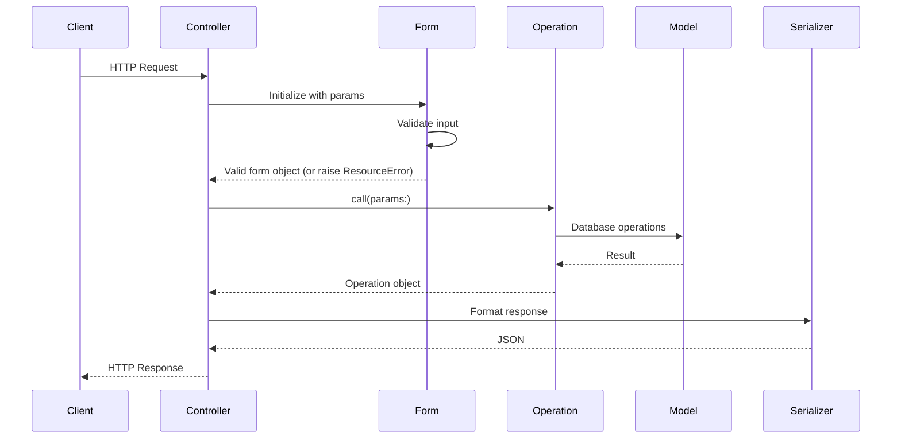
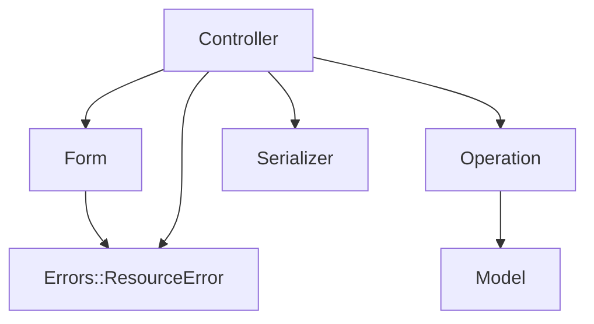

# アーキテクチャ

## HMVC とは

HMVC（Hierarchical Model–View–Controller）は、従来の MVC に **Form** と **Operation** の 2 層を足し、スタックの各部分に責務をはっきり分けるパターンです。

根底にあるのは **Single Responsibility Principle（単一責任の原則）** で、各クラスはひとつの役割に集中します。

## ディレクトリ構成

```
app/
├── controllers/{version}/           # HTTP request/response
│   └── v1/
│       └── users_controller.rb
├── forms/{version}/{resource}/      # Input validation
│   └── v1/users/
│       ├── create_form.rb
│       └── update_form.rb
├── operations/{version}/{resource}/ # Business logic
│   └── v1/users/
│       ├── index_operation.rb
│       ├── create_operation.rb
│       └── ...
├── serializers/{version}/           # Response formatting
│   └── v1/
│       └── user_serializer.rb
└── models/                          # ActiveRecord models

lib/errors/                          # Custom error classes
```

## リクエストの流れ



## 各レイヤーの役割

### Controller

- HTTP リクエストを**受け**、HTTP レスポンスを**返す**
- 入力検証のために Form を、処理のために Operation を呼ぶ
- レンダリングには `render_collection` / `render_resource` を使う
- **ビジネスロジックを持たない**。**DB に直接触れない**

### Form

- 入力パラメータを**検証**し**変換**する
- 失敗時は `valid!` 経由で `Errors::ResourceError` を送出する
- **データベースには触れない**

### Operation

- **ビジネスロジック**をすべてここに置く
- 公開 API は `call` のみ
- 複雑なフローは private の `step_*` メソッドに分割する
- 永続化や DB アクセスなどの副作用を担当する

### Serializer

- ドメインデータをレスポンス用の JSON に**整形**する
- ビジネスルールは持たない

### Model

- 一般的な ActiveRecord / Mongoid の利用
- associations、scopes、enums
- 重いドメインロジックは `app/models/concerns` に置く

### Error 層

- Controller の `Errorable` concern が `rescue_from` を接続する
- `Errors::ResourceError` — Form 起因の検証エラー
- `Errors::APIError` — HTTP ステータスを明示した API エラー
- `ApplicationError` とそのサブクラス — 慣習的なエラー（not found、unauthorized、forbidden）

## レイヤー間の依存関係



Controller はオーケストレーションの中心です。Form と Operation は意図的に分離され、互いに依存しません。

## 命名規則

| レイヤー | ファイル | クラス |
|----------|----------|--------|
| Controller | `v1/users_controller.rb` | `V1::UsersController` |
| Operation | `v1/users/create_operation.rb` | `V1::Users::CreateOperation` |
| Form | `v1/users/create_form.rb` | `V1::Users::CreateForm` |
| Serializer | `v1/user_serializer.rb` | `V1::UserSerializer` |
