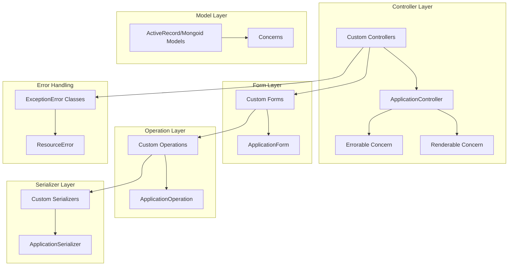
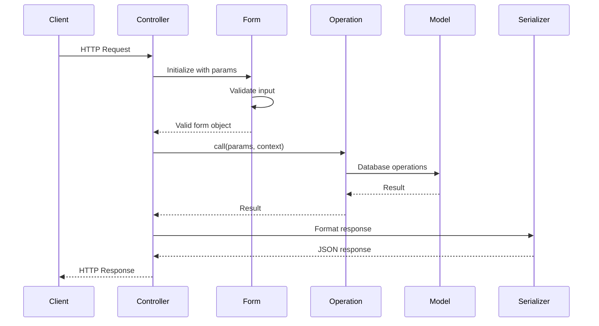

# Technical Design Document: Rails HMVC Gem

## 1. Overview
The `rails-hmvc` gem implements a High-level MVC (HMVC) architecture pattern in Ruby on Rails applications, emphasizing the Single Responsibility Principle (SRP). The gem provides a structured approach to organizing complex Rails applications with clear separation of concerns, enhanced maintainability, and improved testability. It also offers a CLI for generating standardized project components and configuration via YAML.

## 2. Requirements

### 2.1 Functional Requirements
* Generate a complete HMVC structure for new Rails applications
* Provide base classes for all HMVC components (controllers, forms, operations, serializers, etc.)
* Support error handling and standardized JSON responses
* Facilitate validation with custom validators
* Enable serialization for API responses
* Implement middleware support for cross-cutting concerns
* **Provide CLI commands** for initializing HMVC structure and generating resources, operations, forms, and controllers automatically

### 2.2 Non-Functional Requirements
* Maintain Rails conventions while extending functionality
* Ensure backward compatibility with existing Rails plugins and gems
* Provide clear documentation and examples
* Support testing strategies for each component type
* Ensure minimal performance overhead
* **Support configuration** via `rails_hmvc.yml` for defaults (project type, parent classes, route generation, versioning)

## 3. Technical Design

### 3.1 Architecture Overview



### 3.2 Component Definitions

#### 3.2.1 Controllers
The controller layer handles HTTP requests, delegates to operations, and renders responses. It should not contain business logic or direct database calls.

```ruby
# lib/rails/hmvc/controllers/application_controller.rb
module Rails
  module Hmvc
    module Controllers
      class ApplicationController < ActionController::API
        wrap_parameters false

        include Renderable
        include Errorable
      end
    end
  end
end
```

#### 3.2.2 Forms
Forms handle parameter validation and data transformation without interacting with the database.

```ruby
# lib/rails/hmvc/forms/application_form.rb
module Rails
  module Hmvc
    module Forms
      class ApplicationForm
        include ActiveModel::Model
        include ActiveModel::Attributes
        include ActiveModel::Validations::Callbacks

        def valid!
          raise ExceptionError::UnprocessableEntity, error_messages.to_json unless valid?
        end

        private

        def error_messages
          errors.messages.map { |key, value| { key => value.first } }
        end
      end
    end
  end
end
```

#### 3.2.3 Operations
Operations contain business logic, orchestrated in discrete `step_` methods, exposing only a public `call` interface.

```ruby
# lib/rails/hmvc/operations/application_operation.rb
module Rails
  module Hmvc
    module Operations
      class ApplicationOperation
        attr_reader :params, :current_user, :form

        def initialize(params, data = {})
          @params = params
          @current_user = data[:current_user]
        end

        def self.call(params, data = {})
          new(params, data).call
        end
      end
    end
  end
end
```

#### 3.2.4 Serializers
Serializers format data for API responses.

```ruby
# lib/rails/hmvc/serializers/application_serializer.rb
module Rails
  module Hmvc
    module Serializers
      class ApplicationSerializer < ActiveModel::Serializer
        # Base serializer implementation
      end
    end
  end
end
```

#### 3.2.5 Error Handling
Standardized exception and resource error classes.

```ruby
# lib/rails/hmvc/errors/exception_error.rb
module Rails
  module Hmvc
    module Errors
      module ExceptionError
        # Error definitions
      end
    end
  end
end

# lib/rails/hmvc/errors/resource_error.rb
module Rails
  module Hmvc
    module Errors
      class ResourceError
        include ExceptionError
        # Formatting logic
      end
    end
  end
end
```

### 3.3 Request Flow



### 3.4 Directory Structure (Standard HMVC)

```
app/
├── controllers/   # Namespaced controllers (e.g., v1/)
│   └── v1/
│       └── users_controller.rb
├── operations/    # Business logic by resource/version
│   └── v1/users/
│       ├── index_operation.rb
│       └── ...
├── forms/         # Validation by resource/version
│   └── v1/users/
│       ├── index_form.rb
│       └── ...
├── models/        # ActiveRecord/Mongoid models
│   └── user.rb
└── serializers/   # Serializers
    └── application_serializer.rb

lib/
└── errors/        # Custom error classes
    ├── application_error.rb
    ├── not_found_error.rb
    └── unauthorized_error.rb
```

## 4. CLI Commands

Commands read from `rails_hmvc.yml`, with CLI flags overriding.

### 4.1 `rails g hmvc:init`

- **Purpose**: Initialize a new Rails project with HMVC folder structure.
- **Functionality**:
  - Creates `controllers/`, `operations/`, `forms/` directories
  - Injects HMVC configuration into `config/application.rb`

### 4.2 `rails g hmvc:resources`

- **Purpose**: Generate a RESTful resource set (controller, operations, forms, routes).
- **Syntax**:
  ```bash
  rails g hmvc:resources --resources=/v1/users [--type=api|web] [--parent-controller=ClassName] [--parent-operation=ClassName] [--parent-form=ClassName] [--skip-routes=true|false]
  ```
- **Defaults**:
  - `--type` from `rails_hmvc.yml`
  - `--skip-routes=false`
- **Output**:
  - Updates `config/routes.rb`
  - Creates controller, operations, and forms under specified namespace

### 4.3 `rails g hmvc:operation`

- **Purpose**: Generate one or multiple operations.
- **Syntax**:
  ```bash
  rails g hmvc:operation --resources=/v1/users [--resource=/v1/users/create] [--type=api|web] [--parent=ApplicationOperation]
  ```
- **Behavior**:
  - Without `--resource`: generates index, show, create, update, destroy operations
  - With `--resource`: generates only specified operation file

### 4.4 `rails g hmvc:form`

- **Purpose**: Generate one or multiple forms.
- **Syntax**:
  ```bash
  rails g hmvc:form --resources=/v1/users [--resource=/v1/users/create] [--type=api|web] [--parent=ApplicationForm]
  ```
- **Behavior** mirrors `hmvc:operation` generation logic.

### 4.5 `rails g hmvc:controller`

- **Purpose**: Generate a controller with standard RESTful actions.
- **Syntax**:
  ```bash
  rails g hmvc:controller --resources=/v1/users [--type=api|web] [--parent=ApplicationController]
  ```
- **Output**: Creates `UsersController` with `index, show, create, update, destroy` actions.

## 5. Configuration (`rails_hmvc.yml`)

```yaml
# config/rails_hmvc.yml

type: api                     # Default project type: api or web
parent_controller: ApplicationController
parent_operation: ApplicationOperation
parent_form: ApplicationForm
skip_routes: false             # Automatically add routes?
versions:
  - v1                       # Default namespace versions
  - v2

types:
  api:
    parent_controller: ApplicationController
  web:
    parent_controller: ApplicationController
```

## 6. Conventions by Layer

- **Controller**: Delegates to operations; uses callbacks (e.g., `before_action :authenticate_user!`); does not contain business logic.
- **Operation**: Only exposes `call`; breaks logic into private `step_` methods.
- **Form**: Only handles validation; calls `valid!` or `validate`; no DB interaction.
- **Model**: Contains associations, scopes, enums; extended logic in `app/models/concerns`.
- **Serializer**: Defines response shapes; inherits from `ApplicationSerializer`.
- **Error Layer**: In `ApplicationController` via `Errorable` concern; rescues exceptions and renders standardized errors.

## 7. Implementation Plan

### 7.1 Phase 1: Core Structure
* Create gem scaffolding
* Implement base classes for controllers, forms, operations, serializers, and error handling
* Scaffold directory structure and concerns

### 7.2 Phase 2: Generators and Templates
* Build CLI generators for HMVC components
* Implement templates for controllers, operations, forms, serializers, and errors
* Integrate route injection logic

### 7.3 Phase 3: Documentation and Examples
* Write detailed README and usage guide
* Provide example Rails application
* Showcase common workflows and best practices

## 8. Testing Strategy
* Unit tests for all base components and concerns
* Integration tests covering end-to-end request flow
* Generator tests to verify file generation and config updates

## 9. Open Questions
* Include model layer extensions for pagination?
* Support GraphQL schema generation?
* Best practices for customizing middleware integration?

## 10. Future Enhancements
* Integration rubocop for convention structure HMVC

