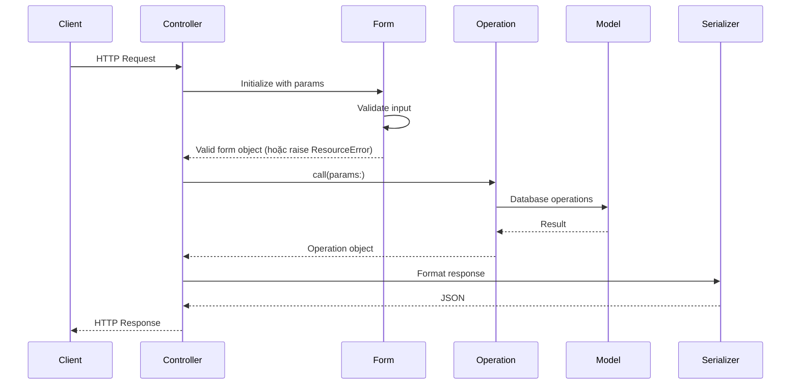
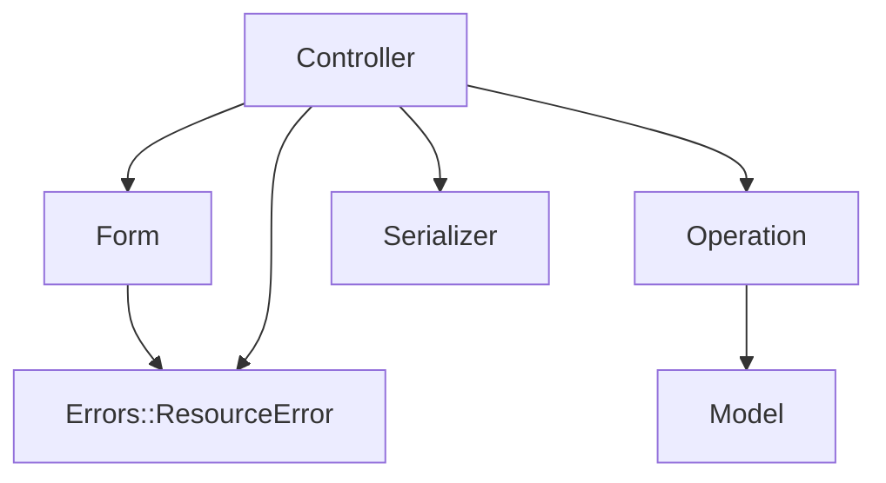

# Architecture

## HMVC là gì?

HMVC (Hierarchical Model-View-Controller) mở rộng MVC truyền thống bằng cách thêm hai layer mới — **Form** và **Operation** — nhằm tách bạch rõ ràng trách nhiệm của từng thành phần.

Nguyên tắc cốt lõi: **Single Responsibility Principle** — mỗi class chỉ làm một việc.

## Cấu trúc thư mục

```
app/
├── controllers/{version}/           # HTTP request/response
│   └── v1/
│       └── users_controller.rb
├── forms/{version}/{resource}/      # Input validation
│   └── v1/users/
│       ├── create_form.rb
│       └── update_form.rb
├── operations/{version}/{resource}/ # Business logic
│   └── v1/users/
│       ├── index_operation.rb
│       ├── create_operation.rb
│       └── ...
├── serializers/{version}/           # Response formatting
│   └── v1/
│       └── user_serializer.rb
└── models/                          # ActiveRecord models

lib/errors/                          # Custom error classes
```

## Request Flow



## Vai trò từng Layer

### Controller
- **Nhận** HTTP request, **trả** HTTP response
- Gọi Form để validate, gọi Operation để xử lý
- Dùng `render_collection` / `render_resource` để render
- **Không** chứa business logic, **không** gọi DB trực tiếp

### Form
- **Validate** và **transform** input params
- Raise `Errors::ResourceError` nếu invalid (via `valid!`)
- **Không** tương tác với database

### Operation
- Chứa toàn bộ **business logic**
- Interface duy nhất là public method `call`
- Logic phức tạp được tách thành các `step_` methods riêng
- Làm mọi thứ liên quan đến DB

### Serializer
- **Format** dữ liệu thành JSON response
- Không chứa logic

### Model
- ActiveRecord/Mongoid standard
- Associations, scopes, enums
- Logic phức tạp tách vào `app/models/concerns`

### Error Layer
- `Errorable` concern trong Controller: `rescue_from` các exception
- `Errors::ResourceError` — lỗi validation từ Form
- `Errors::APIError` — lỗi API có status code tùy chỉnh
- `ApplicationError` và subclasses — lỗi chuẩn (NotFound, Unauthorized, Forbidden)

## Layer Dependencies



Controller là điểm điều phối trung tâm. Form và Operation hoàn toàn độc lập với nhau — Form không biết đến Operation và ngược lại.

## Naming Conventions

| Layer | File | Class |
|-------|------|-------|
| Controller | `v1/users_controller.rb` | `V1::UsersController` |
| Operation | `v1/users/create_operation.rb` | `V1::Users::CreateOperation` |
| Form | `v1/users/create_form.rb` | `V1::Users::CreateForm` |
| Serializer | `v1/user_serializer.rb` | `V1::UserSerializer` |
