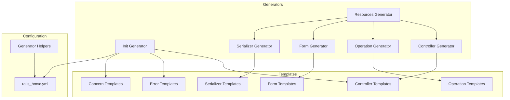
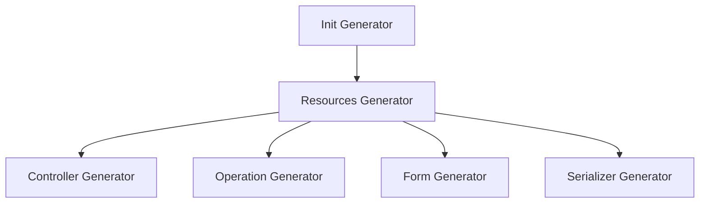
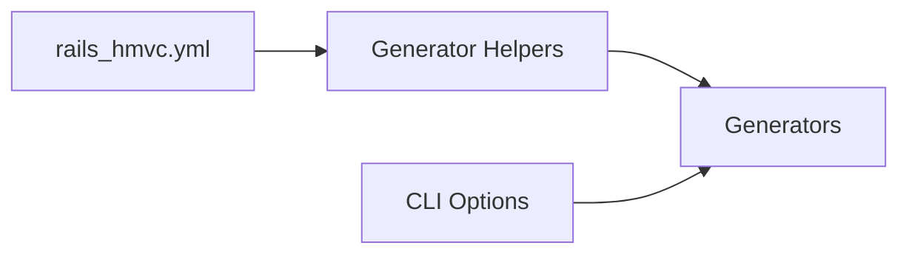
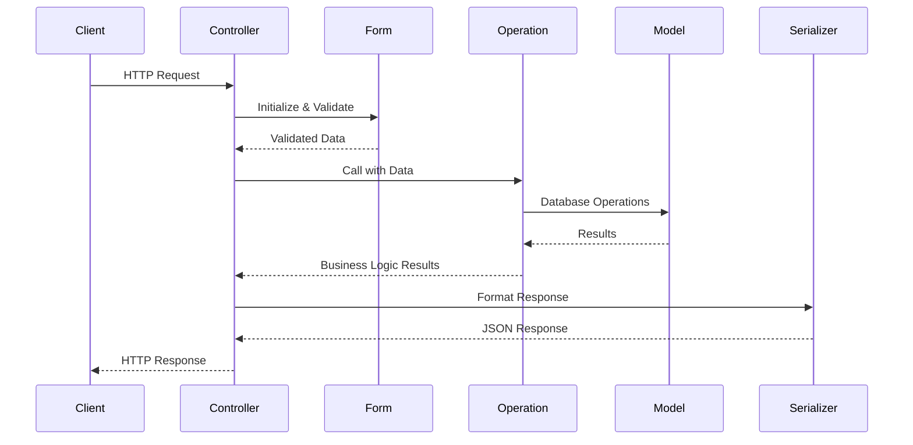
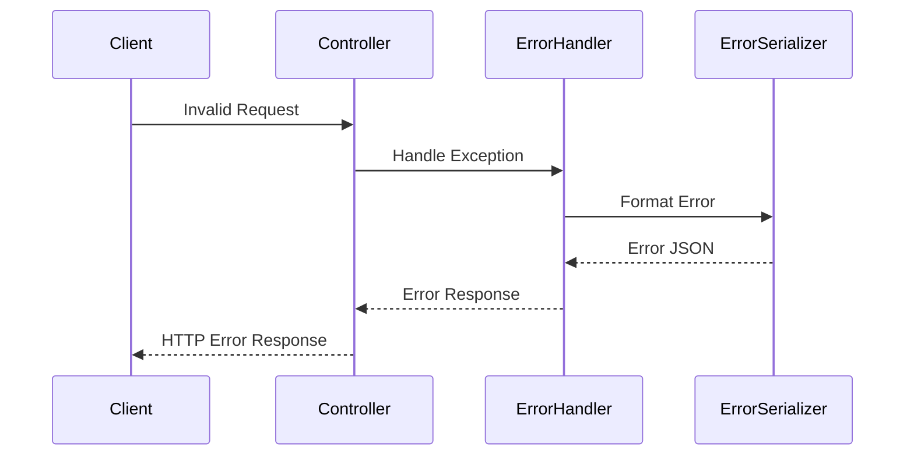

# System Patterns

## System Architecture

Rails HMVC Gem hiện tại sử dụng mô hình "code generation only" thay vì cung cấp runtime components. Gem chỉ cung cấp các generators để tạo ra mã nguồn cần thiết cho dự án Rails mới, nhằm đảm bảo cấu trúc HMVC được áp dụng đúng cách.



## HMVC Pattern

Gem sinh ra cấu trúc code tuân theo mô hình HMVC (Hierarchical Model-View-Controller). Cấu trúc này gồm:

```
app/
├── controllers/   # Xử lý HTTP requests và responses
│   └── v1/
│       └── users_controller.rb
├── operations/    # Xử lý business logic
│   └── v1/users/
│       ├── index_operation.rb
│       └── ...
├── forms/         # Xử lý validation và data transformation
│   └── v1/users/
│       ├── create_form.rb
│       └── ...
├── models/        # ActiveRecord/Mongoid models và database logic
│   └── user.rb
└── serializers/   # Xử lý JSON serialization
    └── v1/
        └── user_serializer.rb

lib/
└── errors/        # Custom error classes
    ├── base_error.rb
    ├── api_error.rb
    └── resource_error.rb
```

## Generator System

### Hierarchical Generator Structure



- **Init Generator**: Khởi tạo cấu trúc HMVC cơ bản
- **Resources Generator**: Tạo đầy đủ các components cho một resource
- **Individual Generators**: Có thể được sử dụng riêng lẻ để tạo components cụ thể

### Configuration System



- **YAML Config**: Cung cấp defaults cho generators
- **CLI Options**: Ghi đè cấu hình từ YAML
- **Generator Helpers**: Xử lý việc đọc và merge cấu hình

## Component Interaction Patterns

### Request Flow



### Error Handling



## Versioning Pattern

Rails HMVC sử dụng namespace-based versioning:

```ruby
# Controller
module V1
  class UsersController < V1Controller
    # ...
  end
end

# Operation
module V1
  module Users
    class CreateOperation < ApplicationOperation
      # ...
    end
  end
end

# URL Routes
# /v1/users
```

Điều này cho phép:
1. Dễ dàng tạo và duy trì nhiều phiên bản API
2. Cô lập các thay đổi không tương thích ngược
3. Cung cấp path rõ ràng cho clients

## Generator Implementation Pattern

### Base Class Pattern
Mỗi generator kế thừa từ `Rails::Generators::Base` hoặc `Rails::Generators::NamedBase`:

```ruby
module RailsHmvc
  module Generators
    class InitGenerator < Rails::Generators::Base
      # ...
    end

    class ResourcesGenerator < Rails::Generators::NamedBase
      # ...
    end
  end
end
```

### Template Method Pattern
Mỗi generator sử dụng template method pattern với các actions được thực hiện theo thứ tự:

```ruby
def create_controller_file
  template('controller.rb', "app/controllers/#{controller_path}.rb")
end

def create_operations
  # Tạo các operations
end

def create_forms
  # Tạo các forms
end
```

### Template Engine Pattern
Sử dụng ERB template engine để render code:

```ruby
# lib/generators/hmvc/controller/templates/controller.rb
class <%= controller_class_name %> < <%= parent_controller_class %>
  # Nội dung template với ERB tags
end
```

### Delegation Pattern
Resources generator delegate việc tạo các components cho các generator con:

```ruby
def create_controller
  args = [
    "#{version}/#{plural_name}",
    "--actions=index,show,create,update,destroy",
    "--version=#{version}",
    "--parent=#{parent_controller_class}"
  ]

  Rails::Generators.invoke "rails_hmvc:controller", args, behavior: behavior
end
```

## Configuration Pattern

### Environment-based Configuration (Cấu trúc hiện tại)
Configuration được tải dựa trên Rails environment:

```ruby
def load_config
  config_path = File.join(destination_root, 'config/rails_hmvc.yml')
  return {} unless File.exist?(config_path)

  env = defined?(Rails.env) ? Rails.env : 'development'

  # Load và return config[env]
end
```

### Option Priority Pattern
Command-line options có priority cao hơn cấu hình YAML:

```ruby
def set_defaults_from_config
  options[:type] ||= @config['type']
  options[:parent_controller] ||= @config['parent_controller']
  # ...
end
```

### Environment-free Configuration Pattern (Đề xuất Cải tiến)
Loại bỏ phân chia môi trường, chỉ giữ cấu hình cho development:

```ruby
def load_config
  config_path = File.join(destination_root, 'config/rails_hmvc.yml')
  return {} unless File.exist?(config_path)

  # Đọc và xử lý YAML file trực tiếp
  # Trả về config không phụ thuộc environment
end
```

### Type-based Configuration Pattern (Đề xuất Cải tiến)
Cấu hình riêng cho từng loại project (api/web):

```yaml
# rails_hmvc.yml
api:
  parent_controller: MainController
  parent_operation: MainOperation
  parent_form: MainForm
  parent_serializer: MainSerializer

web:
  parent_controller: MainController
  parent_operation: MainOperation
  parent_form: MainForm
  parent_serializer: MainSerializer
```

```ruby
def load_config_for_type(type)
  config = load_config
  type_config = config[type.to_s] || {}
  config.merge(type_config)
end
```

### Resource-specific Configuration Pattern (Đề xuất Cải tiến)
Cấu hình chi tiết cho từng loại component:

```yaml
# rails_hmvc.yml
api:
  parent_controller: MainController
  # ...
  controllers:
    actions: [index, show, create]
  operations:
    actions: [index, show, create]
  forms:
    actions: [index, show, create]
    skip_actions: [index, show]
```

```ruby
def get_resource_config(resource_type)
  type = options[:type] || 'api'
  config = load_config_for_type(type)
  config[resource_type.to_s] || {}
end
```

## Template Organization Pattern

### Current Template Structure
Hiện tại, mỗi generator có thư mục templates riêng:

```
lib/generators/hmvc/
├── controller/
│   └── templates/
│       └── controller.rb
├── form/
│   └── templates/
│       └── form.rb
├── operation/
│   └── templates/
│       └── operation.rb
├── serializer/
│   └── templates/
│       └── serializer.rb
```

### Enhanced Templates with HTTP Method Comments (Đề xuất Cải tiến)
Cập nhật controller template để thêm comments về HTTP method và route:

```ruby
# Controller template
class <%= controller_class_name %> < <%= parent_controller_class %>
  # [GET] /<%= namespace_path %>/<%= plural_name %>
  def index; end

  # [GET] /<%= namespace_path %>/<%= plural_name %>/:id
  def show; end

  # [POST] /<%= namespace_path %>/<%= plural_name %>
  def create; end

  # [PUT] /<%= namespace_path %>/<%= plural_name %>/:id
  def update; end

  # [DELETE] /<%= namespace_path %>/<%= plural_name %>/:id
  def destroy; end
end
```

### Updated Operation Structure (Đề xuất Cải tiến)
Template với cấu trúc operation đơn giản:

```ruby
class <%= namespace_name %>::<%= operation_class_name %>Operation < <%= parent_operation_class %>
  def call; end
end
```

### Updated Form Structure (Đề xuất Cải tiến)
Template với cấu trúc form đơn giản:

```ruby
class <%= namespace_name %>::<%= form_class_name %> < <%= parent_form_class %>
  # Attributes và validations
end
```

## Path-based Namespace Generation Pattern (Đề xuất Cải tiến)

### Current Version-based Namespace
Phụ thuộc vào cấu hình api_version:

```ruby
def controller_path
  if class_path.empty?
    "#{version}/#{plural_name}_controller"
  else
    components = class_path.dup
    if components.first == version
      class_path.join('/') + '_controller'
    else
      "#{version}/#{components.join('/')}_controller"
    end
  end
end
```

### Updated Path-based Namespace
Không phụ thuộc api_version, dựa vào path:

```ruby
def namespace_from_path(path)
  path.split('/').map(&:underscore)
end

def class_name_from_path(path)
  components = namespace_from_path(path)
  resource_name = components.pop
  namespace = components.map(&:camelize).join('::')
  [namespace, resource_name.camelize].join('::')
end

def controller_path_from_path(path)
  namespace_from_path(path).join('/') + '_controller'
end
```

## Initialization Pattern

### Current Initialization Pattern
Hiện tại sửa đổi application.rb trực tiếp:

```ruby
def modify_application_rb
  inject_into_file 'config/application.rb', after: "class Application < Rails::Application\n" do
    <<-RUBY
    # Load HMVC configuration
    config.before_configuration do
      rails_hmvc_config = Rails.root.join('config', 'rails_hmvc.yml')
      if File.exist?(rails_hmvc_config)
        # Loading and applying config...
      end
    end
    RUBY
  end
end
```

### Initializer-based Configuration Pattern (Đề xuất Cải tiến)
Sử dụng initializer riêng:

```ruby
def create_initializer
  template 'config/initializers/rails_hmvc.rb.tt', 'config/initializers/rails_hmvc.rb'
end
```

```ruby
# initializer template
rails_hmvc_config = Rails.root.join('config', 'rails_hmvc.yml')
if File.exist?(rails_hmvc_config)
  config_data = YAML.safe_load(File.read(rails_hmvc_config))
  config_data.each do |key, value|
    Rails.configuration.send("#{key}=", value) if Rails.configuration.respond_to?("#{key}=")
  end
end
```
