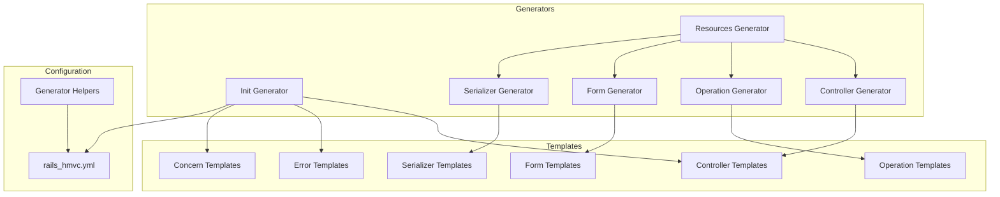
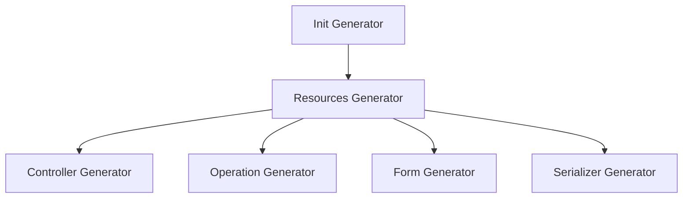
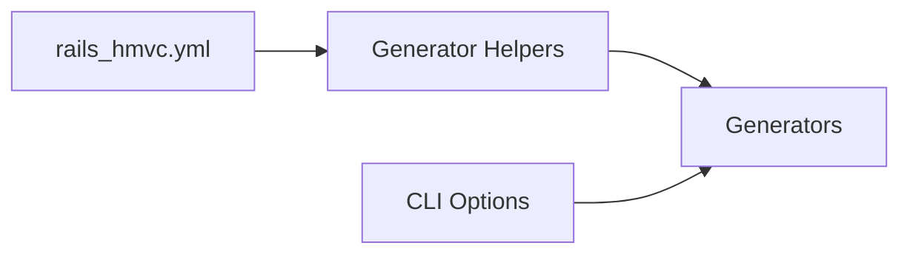
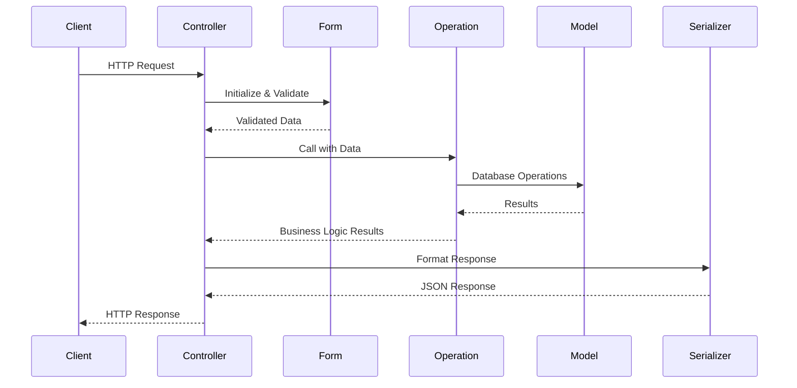
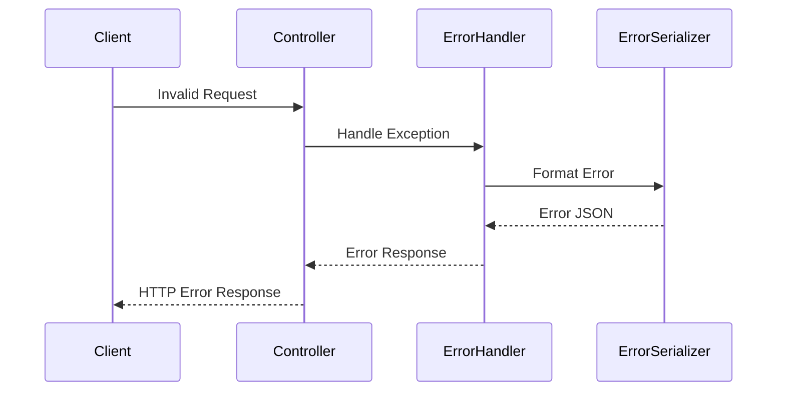

# System Patterns

## System Architecture

Rails HMVC Gem hiện tại sử dụng mô hình "code generation only" thay vì cung cấp runtime components. Gem chỉ cung cấp các generators để tạo ra mã nguồn cần thiết cho dự án Rails mới, nhằm đảm bảo cấu trúc HMVC được áp dụng đúng cách.



## HMVC Pattern

Gem sinh ra cấu trúc code tuân theo mô hình HMVC (Hierarchical Model-View-Controller). Cấu trúc này gồm:

```
app/
├── controllers/   # Xử lý HTTP requests và responses
│   └── v1/
│       └── users_controller.rb
├── operations/    # Xử lý business logic
│   └── v1/users/
│       ├── index_operation.rb
│       └── ...
├── forms/         # Xử lý validation và data transformation
│   └── v1/users/
│       ├── create_form.rb
│       └── ...
├── models/        # ActiveRecord/Mongoid models và database logic
│   └── user.rb
└── serializers/   # Xử lý JSON serialization
    └── v1/
        └── user_serializer.rb

lib/
└── errors/        # Custom error classes
    ├── base_error.rb
    ├── api_error.rb
    └── resource_error.rb
```

## Generator System

### Hierarchical Generator Structure



- **Init Generator**: Khởi tạo cấu trúc HMVC cơ bản
- **Resources Generator**: Tạo đầy đủ các components cho một resource
- **Individual Generators**: Có thể được sử dụng riêng lẻ để tạo components cụ thể

### Configuration System



- **YAML Config**: Cung cấp defaults cho generators
- **CLI Options**: Ghi đè cấu hình từ YAML
- **Generator Helpers**: Xử lý việc đọc và merge cấu hình

## Component Interaction Patterns

### Request Flow



### Error Handling



## Versioning Pattern

Rails HMVC sử dụng namespace-based versioning:

```ruby
# Controller
module V1
  class UsersController < V1Controller
    # ...
  end
end

# Operation
module V1
  module Users
    class CreateOperation < ApplicationOperation
      # ...
    end
  end
end

# URL Routes
# /v1/users
```

Điều này cho phép:
1. Dễ dàng tạo và duy trì nhiều phiên bản API
2. Cô lập các thay đổi không tương thích ngược
3. Cung cấp path rõ ràng cho clients
